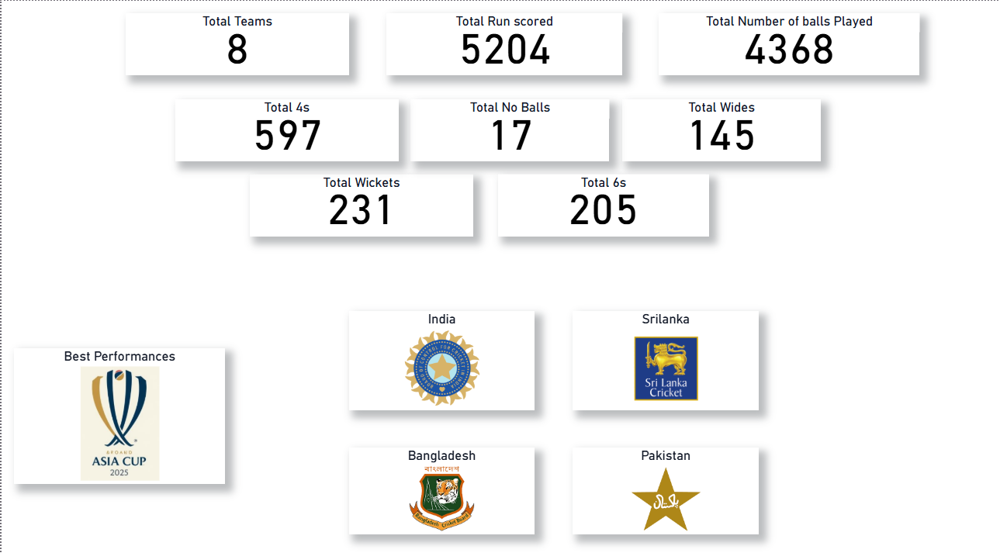
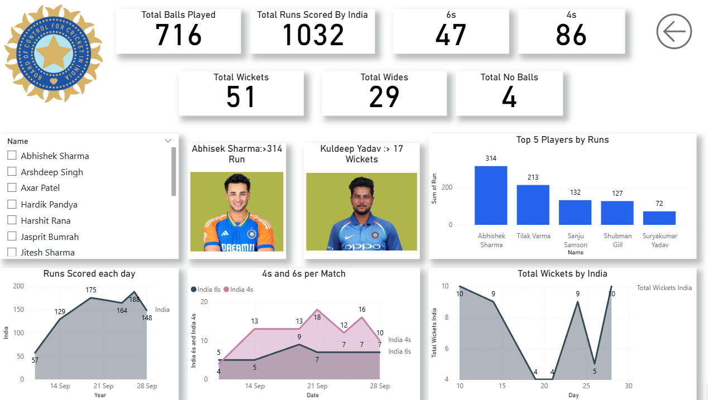
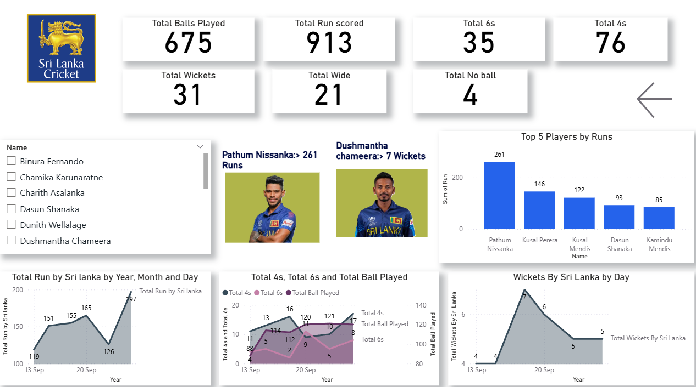
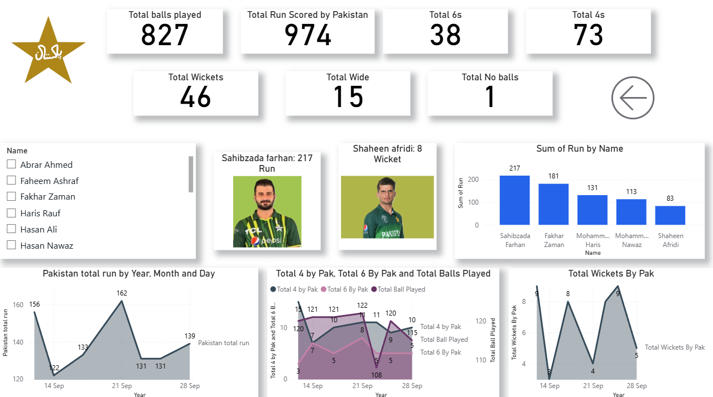
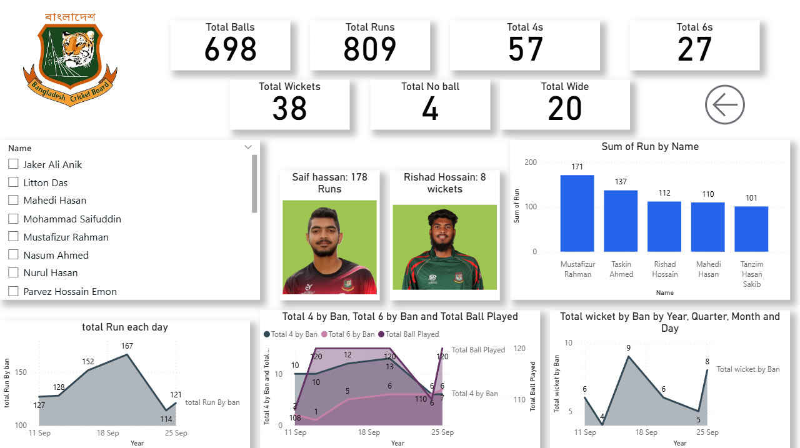

# 📊 Asia Cup Power BI Dashboard

## 📌 Overview
This project is an interactive Power BI dashboard built to analyze Asia Cup cricket data.  
It provides insights into team performance, player statistics, and match trends using data visualization and DAX.

---

## 🎯 Objectives
- Analyze overall and team-wise performance
- Identify top-performing batsmen and bowlers
- Track match-wise trends (runs, wickets, boundaries)
- Enable interactive exploration using filters and slicers

---

## 📈 Key Features
- Multi-page dashboard (Overview + Team-wise analysis)
- KPI tracking:
  - Total Runs
  - Total Balls Played
  - Total 4s & 6s
  - Total Wickets
  - Extras (Wides, No Balls)
- Top 5 Players analysis (Runs)
- Player-level filtering using slicers
- Trend analysis (Runs, Wickets over time)
- Clean and consistent UI design

---

## 🛠 Tools & Technologies
- Power BI
- DAX (Data Analysis Expressions)
- Data Modeling

---

## 🧩 Data Modeling
- Multiple tables used (Batting, Bowling, Matches, Players, etc.)
- Relationships created between fact and dimension tables
- Measures created using DAX for KPIs and analysis

---

## 📊 Key Insights

### 🏏 Overall Tournament
- India recorded the highest total runs among all teams
- Teams showed varying performance in batting and bowling metrics

### 🇮🇳 India
- Abhishek Sharma was the top scorer (314 runs)
- Kuldeep Yadav led in wickets (17)
- Strong and consistent batting performance observed

### 🇱🇰 Sri Lanka
- Pathum Nissanka was the top scorer (261 runs)
- Dushmantha Chameera led in wickets (7)
- Performance showed fluctuations across matches

### 📌 General Observations
- Top players significantly contribute to total team performance
- Match-wise trends reveal performance consistency and dips
- Boundary count (4s & 6s) strongly impacts total runs

## 📸 Dashboard Preview

### 🔹 Overview Page

---

### 🔹 India Analysis

---

### 🔹 Sri Lanka Analysis

---

### 🔹 Pakistan Analysis

---

### 🔹 Bangladesh Analysis

---

## 🚀 How to Use
1. Download the `.pbix` file
2. Open in Power BI Desktop
3. Navigate between pages
4. Use slicers to filter by players/teams

---

## 💡 Learnings
- Built end-to-end Power BI dashboard
- Applied DAX for KPI calculations
- Improved UI/UX design for dashboards
- Learned importance of storytelling in data analysis

---
## 📬 Author
**DatawithRajat**

